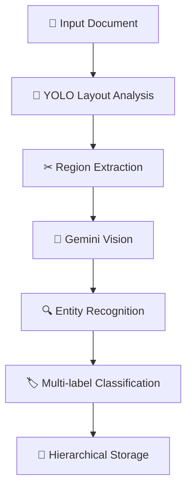
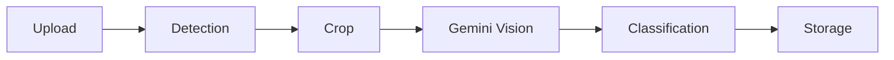

<div align="center">

# 🌌 Intelligent Malayalam Document Understanding Framework


<br>


<br>


</div>

---

# ✨ Overview

> A multimodal document intelligence framework integrating spatial layout parsing and semantic reasoning for automated understanding and hierarchical organization of Malayalam official correspondence.

---

# ⚡ Pipeline



---

# 🚀 Features

### 🎯 Layout-Aware Document Parsing

Deep-learning based region localization using YOLO.

---

### 🧠 Contextual Semantic Understanding

Gemini Vision performs multimodal reasoning on cropped regions.

---

### 🔥 Multi-Recipient Support

Single document → Multiple folders

```text
Chief Engineer
Chairman
```

↓

```text
classified/
├── chief engineer/
└── chairman/
```

---

### ⚙ Dynamic Category Generation

Folders are automatically created:

* Chief Engineer
* Chairman
* Secretary
* Unknown

---

# 🏗 Architecture

```text
               Input Document
                      │
                      ▼
      ┌────────────────────────────┐
      │ YOLO Document Layout Model │
      └────────────────────────────┘
                      │
                      ▼
              Region Cropping
                      │
                      ▼
      ┌────────────────────────────┐
      │ Gemini Vision Inference    │
      └────────────────────────────┘
                      │
                      ▼
         Receiver Designation Extraction
                      │
                      ▼
           Multi-label Classification
                      │
                      ▼
            Hierarchical File Storage
```

---

# 📁 Project Structure

```text
KSHB-Project
│
├── app.py
├── cropper.py
├── classifier.py
├── gemini_extractor.py
│
├── models
│     └── dla-model.pt
│
├── temp
│
└── classified
      ├── chief engineer
      ├── chairman
      ├── secretary
      └── unknown
```

---

# 🛠 Tech Stack

<p align="center">


</p>

---

# 📈 Workflow



---

# ⚡ Run

```bash
pip install -r requirements.txt
python app.py
```

---

# 🔮 Future Enhancements

* OCR-Free Document Intelligence
* LayoutLM Integration
* Batch Processing
* Semantic Search
* Vector Database
* RAG Pipeline
* Metadata Indexing
* Web Deployment

---

<div align="center">

# ⭐ Star this repository if you found it useful!


</div>
